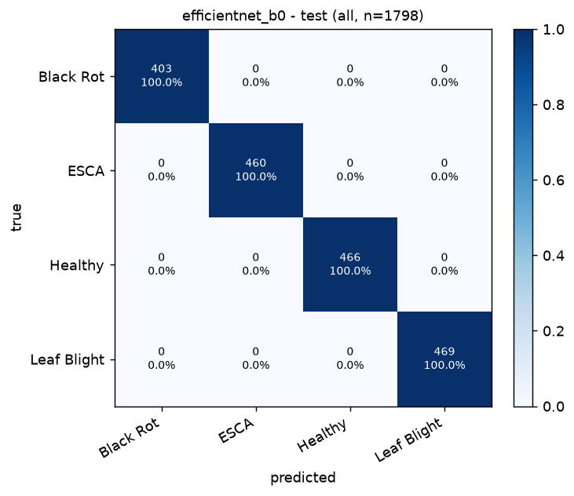

# Grapevine Leaf Disease Classification

Classifies a photo of a single grape leaf as **Black Rot**, **ESCA**, **Healthy** or **Leaf Blight**.
Three ImageNet-pretrained CNNs (MobileNetV2, ResNet50, EfficientNet-B0) are fine-tuned on a
**leaf-level, leakage-audited split**, compared on standard metrics, and the best one (chosen on
the validation set only) is served with Grad-CAM explanations through a CLI and a Streamlit app.

**Live app:** <https://grapevine-disease-classifier.streamlit.app/> (Streamlit Community Cloud; upload a leaf
photo to get the class, confidence and Grad-CAM heatmap).

All numbers in this README and in `artifacts/` come from actual runs on an Apple M2 (8 GB);
`python -m grapevine.report` regenerates `artifacts/reports/results.md` from the output files.

<!-- RESULTS:START -->
## Results

Generated from the output files by `python -m grapevine.report`; full details in [`artifacts/reports/results.md`](artifacts/reports/results.md).

| model | val macro-F1 | test accuracy | test macro-P | test macro-R | test macro-F1 | test ROC-AUC (OvR) | strict test macro-F1 (n) | one-image-per-leaf acc. 95% CI low | background-neutralised test acc. | errors / n | params (M) | CPU latency (ms) | train time (min) | selected |
|---|---|---|---|---|---|---|---|---|---|---|---|---|---|---|
| mobilenet_v2 | 1.0000 | 100.00% | 1.0000 | 1.0000 | 1.0000 | 1.0000 | 1.0000 (1732) | 99.20% | 99.94% | 0 / 1798 | 2.23 | 39.3 | 17.9 |  |
| resnet50 | 1.0000 | 100.00% | 1.0000 | 1.0000 | 1.0000 | 1.0000 | 1.0000 (1732) | 99.20% | 100.00% | 0 / 1798 | 23.52 | 54.5 | 43.9 |  |
| efficientnet_b0 | 1.0000 | 100.00% | 1.0000 | 1.0000 | 1.0000 | 1.0000 | 1.0000 (1732) | 99.20% | 99.89% | 0 / 1798 | 4.01 | 165.0 | 34.6 | **yes** |

**Selected model: efficientnet_b0** (max validation macro-F1, then min validation log-loss, then fewest parameters). On the held-out test split (1798 images from 458 leaves never seen in training): accuracy 100.00%, macro-F1 1.0000, 0 errors.
Counting each leaf once (458/458 correct), the exact 95% interval for accuracy is 99.20% - 100.00%.
With the background painted grey the test accuracy is 99.89% (2 errors).
All models reach the same test accuracy, so the choice rests on the validation log-loss tie-break (mobilenet_v2 0.0797, resnet50 0.0798, efficientnet_b0 0.0781). If CPU latency matters more, mobilenet_v2 is 4.2x faster on CPU (39 vs 165 ms per image): pass `--checkpoint artifacts/runs/mobilenet_v2/best.pt` to `predict`, or set `GRAPEVINE_CHECKPOINT` for the app.



Grad-CAM example grids for the test set are written locally to `artifacts/reports/gradcam/` by `python -m grapevine.gradcam` (they show dataset photos, so they are not committed); the app computes Grad-CAM live for every uploaded image.

<!-- RESULTS:END -->

## 1. What the dataset audit found

The dataset folder (`../Black Rot`, `../ESCA`, `../Healthy`, `../Leaf Blight`, 3,000 files each)
is not 12,000 independent photos:

| Finding | Evidence (from `artifacts/data/data_report.json`) | Risk |
|---|---|---|
| 46 byte-identical copies (`... (1).JPG/.png`) | MD5 hashes | exact duplicates across splits |
| JPGs (256x256, PlantVillage) carry offline augmentations that share a UUID: `flipLR`; Healthy also `90/180/270deg` and `new30degFlipLR` | filename parser, 3,499 UUIDs for 6,578 JPGs | flipped/rotated copy of a test photo in train |
| PNGs (224x224) were written by Keras `ImageDataGenerator.flow(save_to_dir)` as `_<source index>_<random>.png`: **24 source leaves per class, ~56 random augmentations each** (5,376 files = 45% of the data come from 96 leaves) | filename parser + visual check | 55 siblings of every test PNG in train |
| **85 of the 96 PNG source leaves are also present as JPG photos** | SIFT/RANSAC geometric verification | cross-format leakage invisible to filenames |
| Many leaves were **photographed several times in a row** under different UUIDs (consecutive photo numbers, slightly moved/re-lit) | 65% of 6-inlier JPG pairs from the embedding shortlist have photo numbers <= 3 apart, vs 0.74% of random same-class pairs | same physical leaf in train and test |
| Only Healthy contains 30-degree rotations with **black corners** | `new30degFlipLR` tag | label shortcut (black corners -> Healthy) |
| **Backgrounds differ by class** (capture bias) | background-only colour probe: 76.86% test accuracy vs 25% chance (`background_bias.json`) | model may learn the photo session instead of the disease |

A random file-level split would therefore put copies of the same leaf on both sides of the split
and report inflated scores.

## 2. Leakage prevention

1. **Exact duplicates** removed by MD5 (the non-`(k)` copy is kept).
2. **Filename groups**: every JPG UUID and every Keras source index is one group.
3. **Same-leaf detection across groups** (`grapevine/dedup.py`, `grapevine/geometric.py`):
   * candidates = each image's 15 most similar images from other groups (frozen ImageNet
     MobileNetV2 embedding, flip-averaged) + all JPG pairs with consecutive photo numbers (<= 3 apart);
   * every candidate pair is verified with SIFT keypoints (ratio test + mutual nearest neighbour)
     and a RANSAC affine fit, mirror-aware, rejecting degenerate transforms; keypoints on the black
     rotation fill are masked out;
   * link rule (same class only): >= 8 inliers, or >= 6 for consecutive photos. Thresholds were set
     from measured distributions: among the 10,252 *cross-class* shortlist pairs (ground-truth
     different leaves) none reached 8 inliers, while augmented copies of one photo reach >= 28.
     One cross-class pair from the deeper audit search (two Keras PNGs with similar streaky
     backgrounds) did reach 9; cross-class pairs are reported but never merged;
   * linked groups are merged with union-find into **leaf groups**.
   A global embedding threshold alone does not work here (same-leaf and similar-leaf similarities
   overlap; see `artifacts/data/embedding_similarity.png`) and was rejected after it merged the
   whole Healthy class into one group.
4. **Stratified group split** 70/15/15 of *leaf groups* per class, with the large Keras groups and
   the small photo groups allocated separately so each split gets its share of both.
5. **Audit**: every val/test image is compared with its 40 most similar *training* images; any pair
   meeting the link rule is merged and the split redone, until an audit round finds nothing.
6. **Hard checks** (the script refuses to write `splits.csv` otherwise): no leaf group, filename
   group or identical file in two splits, no verified same-leaf pair across splits, every class in
   every split.
7. **Strict view**: held-out images that still have a weak, unconfirmed match (>= 6 inliers) to a
   training image are reported separately (`strict_no_weak_train_match`).
8. **No test-set decisions**: normalisation uses fixed ImageNet statistics, early stopping and model
   selection use the validation split; the test split is only read for reporting and diagnostics
   (`evaluate`, `gradcam`, `bias_check`, `report`), never by `train` or `compare`'s selection rule.
9. **Shortcut mitigation**: black-filled random rotations are applied to *all* classes during
   training, and `evaluate` checks whether adding black corners pushes other classes to Healthy.
10. **Capture-bias checks**: `bias_check` measures how well background colour alone predicts the
    class (logistic regression on background-like border pixels, train -> test), and `evaluate`
    re-scores every model on test images whose background has been painted uniform grey
    (`artifacts/data/background_neutralized_examples.jpg`).

Visual checks of every threshold are saved in `artifacts/data/*.jpg` (weakest accepted links,
strongest rejected pairs, PNG-to-JPG source matches, cross-class matches).

## 3. Preprocessing and training

* Input: RGB, 224x224 (JPGs are resized from 256, PNGs are native 224), ImageNet mean/std.
* Train augmentation: `RandomResizedCrop(224, scale 0.7-1)`, horizontal + vertical flips, random
  90-degree rotations, black-filled +/-30-degree rotation (p=0.25), mild colour jitter.
* **Group-capped sampler**: each epoch uses every photo but at most 16 random files of each leaf
  group, so the 56-copy Keras groups do not dominate (5,049 of 8,180 training files per epoch).
* Two-phase transfer learning (identical for all three models):
  1. 2 epochs training only the new head (backbone frozen, BatchNorm statistics kept), AdamW lr 1e-3;
  2. up to 8 epochs fine-tuning everything except the stem and stride-8 stages, AdamW lr 2e-4 with
     warm-up + cosine decay, label smoothing 0.1, weight decay 1e-4, early stopping (patience 3).
* The checkpoint with the best validation macro-F1 (ties: lower validation loss) is kept.

### Hardware choices (measured on this M2 / 8 GB, batch 32, MPS)

| Setting | Measured training throughput |
|---|---|
| ResNet50 full fine-tuning, fp16 AMP | 9.7 img/s, 4.3 GB GPU memory |
| ResNet50, first half of the layers frozen, fp16 AMP | **21.0 img/s, 2.3 GB** |
| EfficientNet-B0 full vs first half frozen (fp32) | 13.9 vs **29.3 img/s** |
| MobileNetV2 full vs first half frozen (fp32) | 50.9 vs **63.3 img/s** |
| ResNet50 fp32 vs fp16 AMP (full, earlier session) | 7.2 vs 15.0 img/s; AMP gave no gain for the other two |
| `channels_last` (MobileNetV2) | 24.2 vs 50.9 img/s (slower, not used) |
| batch 64 | drove swap to 7.4/8 GB (not used) |

The benchmark froze the first half of each network's parameter tensors as a proxy for the final
policy (stem up to the stride-8 stage frozen). Throughput varied between sessions because other
applications were using memory; each comparison was measured back to back.

## 4. Usage

```bash
cd grapevine_classifier
python3 -m venv .venv && .venv/bin/pip install -r requirements-train.txt
./run_pipeline.sh                      # audit + split, train 3 models, evaluate, compare, Grad-CAM, report
```

Individual steps (run from `grapevine_classifier/`):

```bash
.venv/bin/python -m grapevine.prepare_data          # manifest, same-leaf grouping, split, audit (~10 min)
.venv/bin/python -m grapevine.bias_check            # background-only capture-bias probe (~2 min)
.venv/bin/python -m grapevine.train --model resnet50  # or mobilenet_v2 / efficientnet_b0
.venv/bin/python -m grapevine.evaluate --all
.venv/bin/python -m grapevine.compare                # selects the best model on validation macro-F1
.venv/bin/python -m grapevine.gradcam                # Grad-CAM grids for test images
.venv/bin/python -m grapevine.report                 # writes artifacts/reports/results.md
```

Predict one or more images (prints the label, confidence and all class probabilities):

```bash
.venv/bin/python -m grapevine.predict path/to/leaf.jpg --gradcam-dir outputs/
```

Web app (upload a leaf, see prediction, confidence bar chart and Grad-CAM):

```bash
.venv/bin/streamlit run app.py
```

Unit tests: `.venv/bin/python -m tests.test_core`.

The dataset location defaults to the folder containing the project; override with
`GRAPEVINE_DATA_ROOT=/path/to/dataset`.

## 5. Deployment (Streamlit Community Cloud)

The repository is deployable as is: Community Cloud installs `requirements.txt` (CPU-only PyTorch,
~200 MB instead of the ~2.5 GB CUDA build) and runs `app.py`, which loads the committed model
`artifacts/best_model/model.pt` (16 MB, no Git LFS needed) on CPU.

1. Push this folder to a GitHub repository (`main` branch).
2. Open <https://share.streamlit.io>, sign in with GitHub, and choose **Create app -> Deploy a
   public app from GitHub** (or open
   <https://share.streamlit.io/deploy?repository=mehakmittal1234/grapevine-disease-classifier&branch=main&mainModule=app.py>).
3. Repository `mehakmittal1234/grapevine-disease-classifier`, branch `main`, main file `app.py`; app URL
   `grapevine-disease-classifier` (live at <https://grapevine-disease-classifier.streamlit.app/>); under
   **Advanced settings** select **Python 3.12** (3.13 and 3.14 also work); click **Deploy**.
4. The first build takes a few minutes. Apps on the free tier sleep after a period without
   traffic and wake on the next visit.

Test the exact cloud setup locally (Linux x86_64 container, same installer `uv`):

```bash
docker run --rm --platform linux/amd64 -p 8501:8501 -v "$PWD":/app -w /app python:3.12-slim \
  sh -c "pip install -q uv && uv pip install --system -r requirements.txt && streamlit run app.py --server.address 0.0.0.0"
```

## 6. Project layout

```
grapevine_classifier/
  app.py                    Streamlit app (entry point on Streamlit Community Cloud)
  .streamlit/config.toml    Streamlit server settings (upload limit, no usage stats)
  run_pipeline.sh           end-to-end pipeline
  requirements.txt          app runtime dependencies (CPU-only PyTorch on Linux) - used by the cloud
  requirements-train.txt    full training stack, pinned versions used for the reported results
  grapevine/
    config.py               paths, classes, hyper-parameters (single source of truth)
    manifest.py             file scan, filename parsing, MD5, image checks
    embeddings.py           frozen MobileNetV2 embeddings (shortlist only)
    geometric.py            SIFT + RANSAC verification (multi-process, torch-free)
    dedup.py                candidate pairs, link rule, union-find
    split.py                stratified group split + leakage checks
    prepare_data.py         data audit / split CLI
    bias_check.py           background-only capture-bias probe
    dataset.py              transforms, Dataset, group-capped sampler, loaders
    models.py               model factory, freezing policy, Grad-CAM layers
    train.py                two-phase training CLI
    evaluate.py             metrics, views, bootstrap CIs, shortcut check, latency
    compare.py              comparison table, model selection, model card
    gradcam.py              Grad-CAM implementation + example grids
    predict.py              Predictor class + CLI
    report.py               results.md generator
    viz.py                  figures
  tests/test_core.py        unit tests
  artifacts/
    data/                   manifest.csv, splits.csv, data_report.json, audit figures
    runs/<model>/           best.pt, history.csv, training_curves.png, config.json
    reports/                metrics.json, confusion matrices, predictions, comparison, Grad-CAM
    best_model/             model.pt + model_card.json (selected model)
```

## 7. Reproducibility

* One seed (42) drives the split, sampler, augmentation and weight initialisation; the split is
  deterministic and saved (`artifacts/data/splits.csv`), and its SHA-256 is stored in each checkpoint.
* Exact package versions are pinned in `requirements-train.txt`; each run stores its configuration and
  environment (`artifacts/runs/<model>/config.json`, checkpoint metadata).
* GPU kernels on Apple MPS are not bit-wise deterministic, so retraining can differ slightly in the
  last decimals.

## 8. Limitations

* All images are lab-style photos of single leaves on a plain background (PlantVillage-like). The
  scores do not transfer to field photos with complex backgrounds, several leaves or other diseases.
* The classes were photographed under different conditions: background colour alone predicts the
  class with 76.86% test accuracy. The background-neutralised evaluation tests the trained models
  against this, but cannot rule out subtler session cues (lighting, camera, leaf preparation).
* Same-leaf detection is evidence-based, not ground truth. The weak cases it could not confirm are
  quantified and excluded in the strict view rather than ignored.
* Results come from one training run per architecture (no repeated seeds); the confidence intervals
  reflect test-set sampling only.
